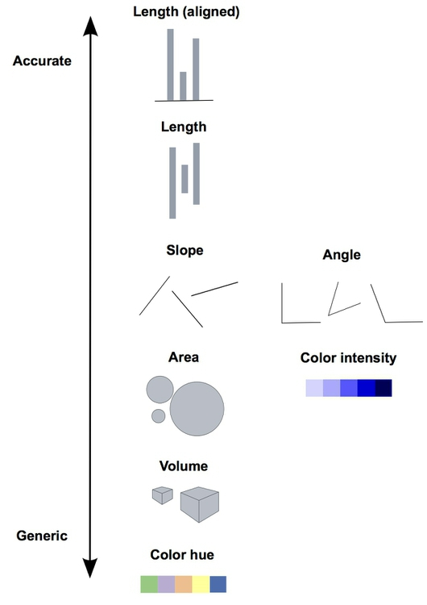

```{r setup, include=FALSE}
library(learnr)
library(gridExtra)
library(tidyverse)
library(dslabs)

tutorial_options(exercise.timelimit = 60)
knitr::opts_chunk$set(error = TRUE)
```

## Welcome

This is a tutorial on data visualization principles. It was created for the course STAT3150--Statistical Computing at the University of Manitoba.

###  

In this tutorial, you will learn how to:

  * choose the right visual cues for your data visualization
  * understand when the axis should include 0
  * identify which visual cues can distort quantities
  * emphasize important comparisons

The readings in this tutorial follow the book [_Introduction to Data Science_](https://rafalab.github.io/dsbook/) by Rafael Irizarry, Chapter 9.

We will use the `tidyverse` package for data manipulation and visualization (it automatically loads `ggplot2`), and we will use the datasets in the `dslabs` package to illustrate the main points.

## Visual Cues

### Visual toolbox

Let's say we want to create a data visualization based on a single variable (e.g. age, income, blood pressure). In class, we discussed several graphics that can be used: histograms, bar plots, boxplots, etc. But what if we also want to highlight *differences* between subgroups?

As data analysts, we have several visual cues we can use:

  - position
  - angle
  - length
  - area
  - colour
  - angle
  
Not all visual cues are created equal! It turns out that humans are much better at understanding some visual cues (e.g. lengths) than others (e.g. volumes).

### Pie charts

Pie charts form somewhat of a paradox: they are very popular, and yet they are generally considered poor data visualizations. Let's look at an example:

```{r pie1, eval = TRUE}
# Browser preference
df <- data.frame(
  "Browser" = c("Opera", "Safari", "Firefox", "Chrome", "IE"),
  "Y2000" = c(3, 21, 23, 26, 28),
  "Y2015" = c(2, 22, 21, 29, 27)
)
```

```{r pie2, exercise = TRUE, exercise.eval = TRUE}
# Can trick ggplot to make a pie chart:
# Make a bar chart in polar coordinates
ggplot(df, aes(x = "", y = Y2000, fill = Browser)) + 
  geom_bar(stat = "identity") + 
  coord_polar("y", start = 0)
```

Can you really tell which browser was the most popular in 2000? Angles can be hard to understand on their own, but they are also very hard to compare:

```{r pie3, eval = TRUE}
# gather combines Y2000 and Y2015 
# and adds a key column
df_tall <- gather(df, "Year", "Percent", 
                  Y2000, Y2015)
```

```{r pie3-2, exercise = TRUE, exercise.eval = TRUE}
ggplot(df_tall, aes(x = "", y = Percent, fill = Browser)) + 
  geom_bar(stat = "identity") + 
  coord_polar("y", start = 0) +
  facet_grid(~Year)
```

Can you tell if the preference ranking changed between 2000 and 2015? **Pie charts can almost always be replaced by a more useful chart** (or even a table).

In this case, a bar chart can more easily show us changes:

```{r pie4, exercise = TRUE, exercise.eval = TRUE}
ggplot(df_tall, aes(x = Browser, y = Percent)) + 
  geom_bar(stat = "identity") + 
  facet_grid(~Year)
```

### Hierachy of visual cues

Researchers have found that there is a hierarchy of visual cues, from "accurate" to "generic", and we should aim to be as accurate as possible:

```{r vis-hierarchy, echo = FALSE, out.width = "100%", fig.cap = "The original can be found here: http://paldhous.github.io/ucb/2016/dataviz/week2.html"}

```

### Exercise

Using the notes and the code above, instead of using `facet_grid`, can you make a bar chart where preference percentages for the same browser are next to one another and of different colour?

```{r pie5, exercise = TRUE}

```

```{r pie5-solution}
ggplot(df_tall, aes(x = Browser, y = Percent,
                    fill = Year)) + 
  geom_bar(stat = "identity",
           position = "dodge")
```
    
<div id="pie5-hint">
**Hint:** Use `position = "dodge"`.
</div>

## Include Zero?

When constructing the barplots above, we made an important assumption: the length of the bar is proportional to the quantity being displayed. This assumption is important, because it was what allows to compare across browsers and years. Also, it allows us to assess the *relative* difference between them. 

When we don't include zero in a barplot, the lengths are no longer proportional to the quantities. Let's look at an example:
```{r, eval=TRUE}
# Remove Opera from list of browsers
df_tall2 <- filter(df_tall, Browser != "Opera")
```

```{r zero1, exercise = TRUE, exercise.eval = TRUE}
# Restrict the range
ggplot(df_tall2, aes(x = Browser, y = Percent)) + 
  geom_bar(stat = "identity") + 
  facet_grid(~Year) +
  coord_cartesian(ylim = c(20, 30))
```

As we can see, differences of a few percentage points are exaggerated when we remove the bottom of the bars. It looks as if the popularity of Firefox has shrunk by 50%, when in reality the difference is only 2%!

*When should we include zero?* What is important to remember here is that for barplots, the visual cue we use is **length**. When the visual cue is **position**, then excluding zero does not distort the quantity of interest. Here's an example:

```{r zero2, exercise = TRUE, exercise.eval = TRUE}
gapminder %>% 
  filter(year == 2012) %>% # Only keep data from 2012
  ggplot(aes(continent, life_expectancy)) +
  geom_point()
```

In this scatter plot, what matters is the position of the points. Including zero would actually make it harder to compare the position of the points (and a life expectancy of 0 year is nonsensical!).

## Distortion

The `gapminder` dataset also contains information about *fertility*. What if we wanted to add this information to the graph? One possibility would be to make the "size" of the points proportional to the value of fertility.

**But be careful**: Remember from geometry that the area of circle is proportional to the *square* of the radius! So if we make the *radius* proportional to fertility, a country with twice the fertility level of another country would be assigned a point that is *four times* the size of the other country. In other words, because the visual cue is the *area* (or size) of the point, we would be **distorting** the comparisons.

For this reason, `ggplot2` automatically makes the area of the points (and not the radius) proportional to the variable. Let's look at an example:

```{r distort1, exercise = TRUE, exercise.eval = TRUE}
gapminder %>% 
  filter(year == 2012) %>% # Only keep data from 2012
  ggplot(aes(continent, life_expectancy,
             size = fertility)) +
  geom_point()
```

The graph above does not distort the comparisons. For example, we can compare fertility across continents quite easily.

Here's what it would look like if we made the *radius* of the points proportional to fertility:

```{r distort2, exercise = TRUE, exercise.eval = TRUE}
# THIS IS AN EXAMPLE OF WHAT NOT TO DO
gapminder %>% 
  filter(year == 2012) %>% 
  ggplot(aes(continent, life_expectancy,
             size = fertility)) +
  geom_point() +
  scale_radius() # This tells ggplot2 to use radius instead of area
```

As we can see, comparisons are much harder: twice the fertility means a point that is four times bigger!

## Important Comparisons

### Ordering categories

As you may be aware, `R` will automatically order strings in alphabetical order. But really, when is alphabetical order the best to order information? Wouldn't you rather order Canadian provinces from West to East?

Reordering categories according to a more meaningful criterion can often improve your data visualization by making it easier to compare. Let's look at an example using the `murders` dataset. 
```{r eval = TRUE}
data_murders <- murders %>% 
  mutate(murder_rate = total / population * 100000) # Compute rate
```

```{r reorder1, exercise = TRUE, exercise.eval = TRUE}
data_murders %>%
  ggplot(aes(state, murder_rate)) +
  geom_bar(stat = "identity") +
  coord_flip() + # For horizontal bars
  theme(axis.text.y = element_text(size = 6)) + # Shrink text
  xlab("")
```

As we expected, the ordering is alphabetical (from bottom to top). We can easily identify the state with the highest rate (DC), but it's more difficult to identify the state with the smallest rate (is it HI, NH, or VT?). More crucially, it is hard to identify states that have similar rates. 

Instead, we can reorder the states according to the rate themselves. For this, we can use the function `reorder` to arrange US states according to murder rate:

```{r reorder2, exercise = TRUE, exercise.eval = TRUE}
data_murders %>%
  mutate(state = reorder(state, murder_rate)) %>% # Reorder state by murder
  ggplot(aes(state, murder_rate)) +
  geom_bar(stat = "identity") +
  coord_flip() +
  theme(axis.text.y = element_text(size = 6)) +
  xlab("")
```

#### Exercise

The states are grouped in geographical regions. Can you update the bar chart so that the bars are coloured according to the region of the state? Can you identify a correlation pattern?

```{r reorder3, exercise = TRUE}

```

```{r reorder3-solution}
data_murders %>%
  mutate(state = reorder(state, murder_rate)) %>% 
  ggplot(aes(state, murder_rate,
             fill = region)) +
  geom_bar(stat = "identity") +
  coord_flip() +
  theme(axis.text.y = element_text(size = 6)) +
  xlab("")
```
    
<div id="reorder3-hint">
**Hint:** Use `fill = region`.
</div>

### Easier comparisons

How you arrange your visual cues can also make comparisons easier. For example, let's say we want to compare life expectancy between Americas and Europe. To get a sense of the full distribution, we can use histograms:

```{r compare1, exercise = TRUE, exercise.eval = TRUE}
gapminder %>% 
  filter(year == 2012,
         continent %in% c("Americas", "Europe")) %>%
  ggplot(aes(life_expectancy,
             fill = continent)) +
  geom_histogram()
```

Can you determine which continent has the highest average? For this, it may be easier to plot two separate histograms:

```{r compare2, exercise = TRUE, exercise.eval = TRUE}
gapminder %>% 
  filter(year == 2012,
         continent %in% c("Americas", "Europe")) %>%
  ggplot(aes(life_expectancy)) +
  geom_histogram() +
  facet_grid(~ continent)
```

One thing to notice: by default, `ggplot2` uses the same range for the axes. This is a good thing: it prevents distortions. But it is still difficult to determine which continent has the highest average... A *better* solution is to align the two histograms vertically:

```{r compare3, exercise = TRUE, exercise.eval = TRUE}
gapminder %>% 
  filter(year == 2012,
         continent %in% c("Americas", "Europe")) %>%
  ggplot(aes(life_expectancy)) +
  geom_histogram() +
  facet_grid(continent ~ .) # Note: which side of ~ is important!
```

Now, we can clearly see that Europe has a higher average life expectancy. 

When deciding how to arrange your visual cues on the graph, try to find the arragement that makes the **important comparisons** as clear as possible.

#### Exercise 

Actually, it may even be easier to see the difference if we used boxplots. Create a plot with two side-by-side boxplots. Bonus: add the data points on top!

```{r compare4, exercise = TRUE}

```

```{r compare4-solution}
gapminder %>% 
  filter(year == 2012,
         continent %in% c("Americas", "Europe")) %>%
  ggplot(aes(continent, life_expectancy)) +
  geom_boxplot(outlier.colour = NA) +
  geom_jitter(height = 0)
```

## Exercises

### Exercise 1

Look at the following two plots of 1928 rates of measles across the US:

```{r echo = FALSE, eval = TRUE}
gg1 <- us_contagious_diseases %>% 
  filter(disease == "Measles", year == 1928,
         !state %in% c("Hawaii", "Alaska")) %>% 
  mutate(rate = 10000*count/population) %>% 
  ggplot(aes(state, rate)) +
  geom_bar(stat = "identity") +
  coord_flip() +
  theme(axis.text.y = element_text(size = 6)) +
  xlab("")

gg2 <- us_contagious_diseases %>% 
  filter(disease == "Measles", year == 1928,
         !state %in% c("Hawaii", "Alaska")) %>% 
  mutate(rate = 10000*count/population,
         state = reorder(state, rate)) %>% 
  ggplot(aes(state, rate)) +
  geom_bar(stat = "identity") +
  coord_flip() +
  theme(axis.text.y = element_text(size = 6)) +
  xlab("")

gridExtra::grid.arrange(gg1, gg2, ncol = 2)
```

You're interested in determining which states have the highest and lowest rates.

```{r datavizex1, echo = FALSE}
question("Which plot is easier to read?",
         answer("They provide the same information, so they are both equally as good."),
         answer("The plot on the right is better because it orders the states alphabetically."),
         answer("The plot on the right is better because alphabetical order has nothing to do with the disease and by ordering according to actual rate, we quickly see the states with most and least rates.", correct = TRUE),
         answer("Both plots should be a pie chart.", message = "Remember: pie charts are almost always the wrong choice!"),
         allow_retry = TRUE
)
```

### Exercise 2

Look at the following plot showing the average murder rate by region in the US:

```{r eval = TRUE}
murders %>% 
  mutate(rate = total/population*100000) %>%
  group_by(region) %>%
  summarize(avg = mean(rate)) %>%
  ggplot(aes(region, avg)) +
  geom_bar(stat = "identity") +
  ylab("Murder Rate Average")
```

You show this plot to a friend, who replies "I would move to the western region".

```{r datavizex2, echo = FALSE}
question("What is the main problem with your friend's interpretation?",
         answer("The categories are ordered alphabetically."),
         answer("The graph does not show standard errors."),
         answer("It does not show all the data. We do not see the variability within a region and it’s possible that the safest states are not in the West.", correct = TRUE),
         answer("The Northeast has the lowest average.", message = "Their averages are almost the same, but the West has the lowest."),
         allow_retry = TRUE
)
```

### Exercise 3

Create a data visualization that better reflects the variability in rates across states.

```{r datavizex3, exercise = TRUE}
murders %>% 
  mutate(rate = total/population*100000)
```

```{r datavizex3-solution}
murders %>% 
  mutate(rate = total/population*100000) %>% 
  ggplot(aes(region, rate)) +
  geom_boxplot(outlier.colour = NA) +
  geom_jitter(height = 0)
```
    
<div id="datavizex3-hint">
**Hint:** What about boxplots?
</div>
